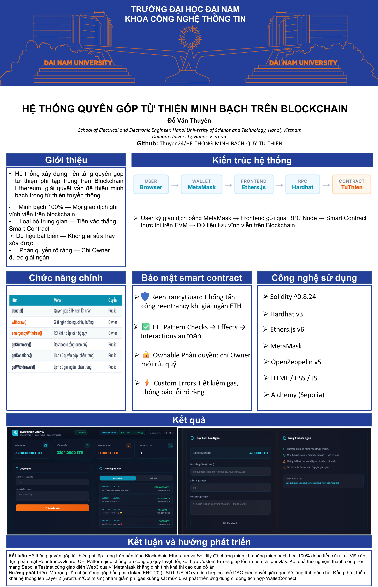
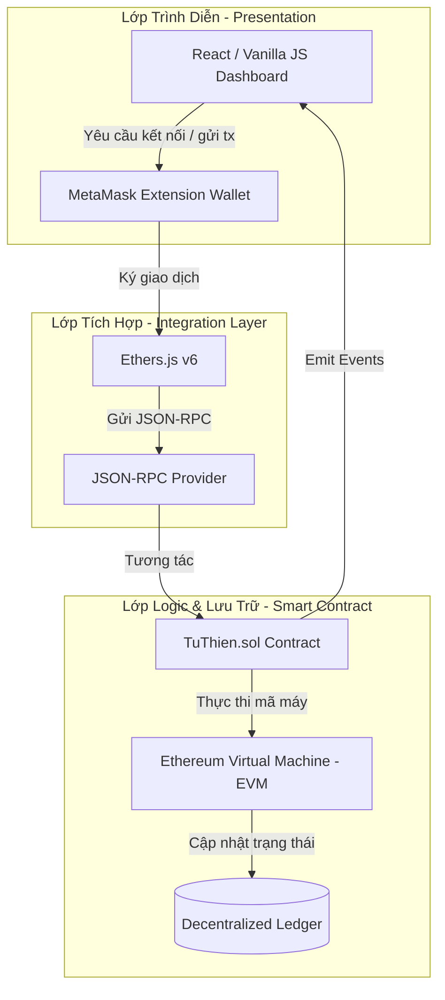

# 🤝 Transparent Charity Crowdfunding System (Blockchain-based)

[](https://soliditylang.org/)
[](https://hardhat.org/)
[](https://docs.ethers.org/)
[](https://opensource.org/licenses/MIT)
[](https://nodejs.org/)

Hệ thống quyên góp và giải ngân quỹ từ thiện minh bạch, phi tập trung được xây dựng trên nền tảng **Ethereum Blockchain**. Đây là đồ án nghiên cứu học thuật nhằm giải quyết triệt để vấn đề mất niềm tin trong các hoạt động cứu trợ truyền thống bằng cách công khai toàn bộ dòng tiền quyên góp và hoạt động giải ngân thời gian thực.

---

## 📊 Poster Báo Cáo (Scientific Poster)

<p align="center">
  
</p>

---

## 🎯 Điểm nổi bật của đề tài

*   **Minh bạch tuyệt đối (100% On-chain):** Mọi giao dịch quyên góp từ nhà hảo tâm và lệnh giải ngân của ban quản trị đều được ghi nhận vĩnh viễn trên sổ cái Blockchain. Không thể sửa đổi hay xóa bỏ.
*   **Bảo mật cấp độ Smart Contract:** 
    *   Tích hợp chống tấn công tái nhập (`ReentrancyGuard`) từ OpenZeppelin.
    *   Phân quyền quản trị chặt chẽ (`Ownable`): Chỉ chủ sở hữu quỹ được phép thực hiện rút tiền giải ngân đến địa chỉ thụ hưởng.
*   **Tối ưu hóa phí Gas:** Sử dụng `Custom Errors` trong Solidity thay cho các chuỗi `require` dài dòng, giúp tiết kiệm chi phí triển khai và thực thi giao dịch.
*   **Trải nghiệm Web3 mượt mà (Modern UI/UX):** Giao diện Dark Mode với tông màu Teal/Cyan hiện đại, tích hợp ví MetaMask, tự động cập nhật số liệu thời gian thực và thông báo động (Toast Messages).

---

## ⚙️ Kiến trúc hệ thống (System Architecture)



---

## 📁 Cấu trúc thư mục dự án (Project Directory Structure)

```text
Blockchain-Charity-System
├── 📁 contracts/               # Thư mục chứa mã nguồn Smart Contract
│   └── 📄 TuThien.sol          # Hợp đồng thông minh quyên góp & giải ngân (Solidity)
├── 📁 frontend/                # Thư mục giao diện ứng dụng Web3 (DApp)
│   ├── 📄 index.html           # Bố cục trang Dashboard chính
│   ├── 📄 styles.css           # Thiết kế giao diện Dark Mode chuẩn UI/UX
│   ├── 📄 app.js               # Logic tương tác ví MetaMask và Ethers.js
│   └── 📄 contract.js          # Chứa địa chỉ hợp đồng và ABI sau khi deploy
├── 📁 scripts/                 # Kịch bản triển khai và tạo tài liệu đồ án
│   ├── 📄 deploy.js            # Script deploy hợp đồng lên Sepolia Testnet
│   ├── 📄 deploy-local.js      # Script deploy local node và tự động seed dữ liệu mẫu
│   ├── 📄 generate_doc.py      # Script Python tổng hợp tài liệu báo cáo Word
│   ├── 📄 doc_helpers.py       # Hàm bổ trợ định dạng văn bản báo cáo Word
│   ├── 📄 gen_part1.py         # Module tài liệu Chương 1, 2 và Lời nói đầu
│   └── 📄 gen_part2.py         # Module tài liệu Chương 3 và 4
├── 📁 docs/                    # Thư mục lưu trữ tài liệu báo cáo sản phẩm
│   ├── 📄 DoAn_BlockchainCharity.docx  # Tệp tài liệu báo cáo hoàn chỉnh (35 trang+)
│   └── 📄 poster.html          # Trang giới thiệu / Poster sản phẩm
├── 📄 hardhat.config.js        # File cấu hình môi trường Hardhat v3
├── 📄 package.json             # Khai báo các thư viện phụ thuộc và scripts npm
└── 📄 .env.example             # File chứa các biến môi trường mẫu
```

---

## 💻 Bộ công cụ & Công nghệ sử dụng

*   **Ngôn ngữ lập trình:** Solidity `0.8.24` (Smart Contract Core), JavaScript (Frontend Dashboard).
*   **Khung phát triển:** Hardhat `v3.4.5` (Biên dịch, chạy node ảo local, viết kịch bản deploy).
*   **Thư viện kết nối Web3:** Ethers.js `v6.16.0` (Tương tác RPC với mạng Ethereum).
*   **Thư viện Smart Contract:** OpenZeppelin Contracts `v5.6.1`.

---

## 🚀 Hướng dẫn cài đặt & Chạy thử nghiệm Local

### 1. Yêu cầu tiên quyết
*   Máy tính đã cài sẵn **Node.js** (phiên bản `>= 18.x`).
*   Trình duyệt đã cài tiện ích ví điện tử **MetaMask**.

### 2. Cài đặt các thư viện phụ thuộc
Mở terminal tại thư mục gốc của dự án và chạy lệnh:
```bash
npm install
```

### 3. Cấu hình môi trường
Tạo tệp `.env` từ tệp mẫu:
```bash
cp .env.example .env
```
*(Chỉ cần điền các khóa bí mật trong `.env` nếu bạn muốn deploy lên mạng thực tế Sepolia Testnet).*

### 4. Chạy cục bộ (Local Development)

*   **Bước 1: Khởi động Blockchain cục bộ (Hardhat Node)**
    ```bash
    npx hardhat node
    ```
    *Lệnh này sẽ khởi tạo một mạng giả lập Ethereum tại cổng `http://127.0.0.1:8545` kèm theo 20 tài khoản test có sẵn 10000 ETH.*

*   **Bước 2: Deploy Smart Contract & Tạo dữ liệu mẫu (Seed Data)**
    Mở một terminal mới và chạy lệnh deploy lên mạng cục bộ:
    ```bash
    npx hardhat run scripts/deploy-local.js --network localhost
    ```
    *Sau khi hoàn thành, địa chỉ hợp đồng và ABI sẽ tự động cập nhật vào cấu hình frontend.*

*   **Bước 3: Chạy Web Server cho giao diện**
    Khởi động máy chủ web tĩnh để hiển thị giao diện:
    ```bash
    npx http-server ./frontend -p 3000 --cors
    ```
    *Truy cập giao diện tại: **`http://localhost:3000`**.*

> [!TIP]
> **Cách tương tác trên giao diện Local:**
> 1. Mở MetaMask, thêm mạng cục bộ (Custom RPC) với RPC URL là `http://127.0.0.1:8545` và Chain ID là `31337`.
> 2. Sao chép Khóa bí mật (Private Key) của tài khoản test từ console Hardhat Node và import vào ví MetaMask của bạn để có ETH test thực hiện quyên góp.

---

## 🌐 Triển khai lên mạng Sepolia Testnet

Để deploy sản phẩm lên mạng thử nghiệm Sepolia thực tế của Ethereum:
1. Mở tệp `.env` và cập nhật khóa bí mật ví của bạn (`PRIVATE_KEY`) và URL RPC Sepolia (`SEPOLIA_RPC_URL`).
2. Chạy lệnh deploy:
   ```bash
   npx hardhat run scripts/deploy.js --network sepolia
   ```
3. Sao chép địa chỉ contract vừa deploy và cập nhật thủ công vào tệp `frontend/contract.js` để frontend kết nối trực tiếp đến testnet.

---

## 👨‍🎓 Thông tin tác giả đồ án

<div align="center">

| Tác giả | Đỗ Văn Thuyên |
| :--- | :--- |
| **Lớp học** | K16 - Công nghệ thông tin |
| **Mã số sinh viên** | 1671020308 |
| **Đơn vị đào tạo** | Khoa Công nghệ thông tin - Trường Đại học Đại Nam |
| **Giảng viên hướng dẫn** | TS. Trần Đăng Công |

</div>

---

## 📄 Giấy phép (License)

Dự án này được cấp phép theo các điều khoản của **MIT License**.
